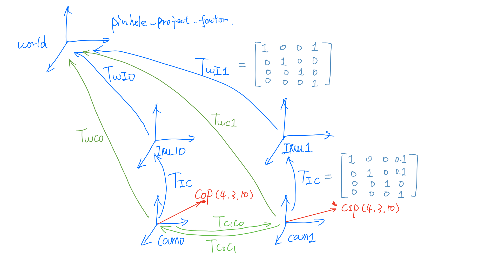
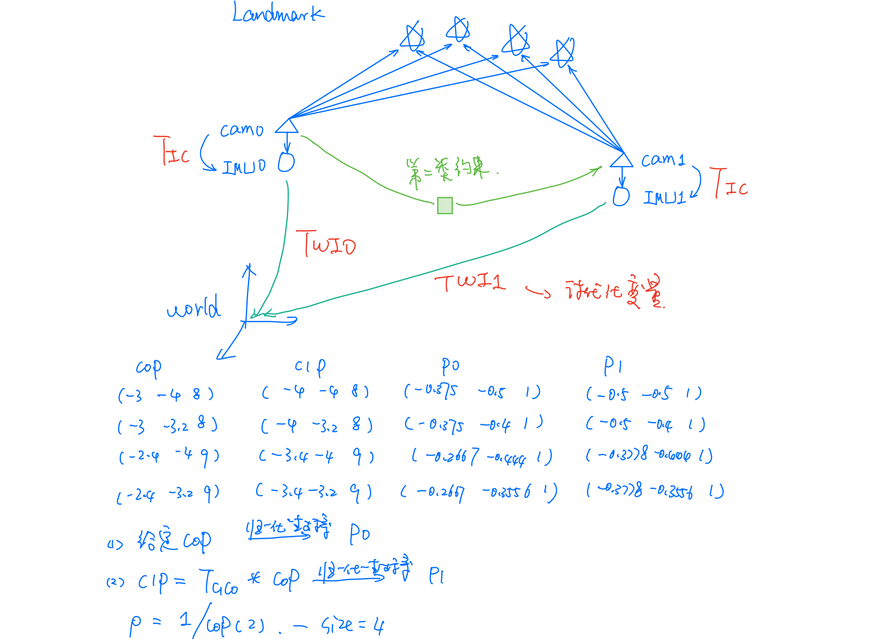
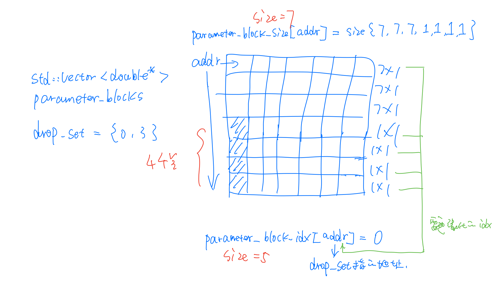
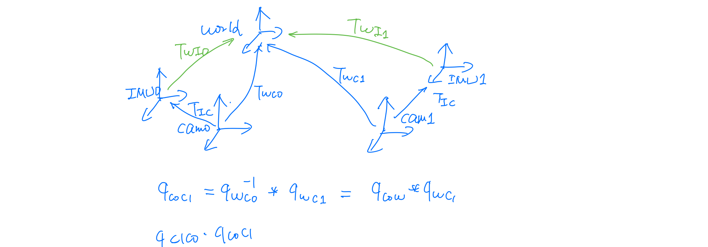
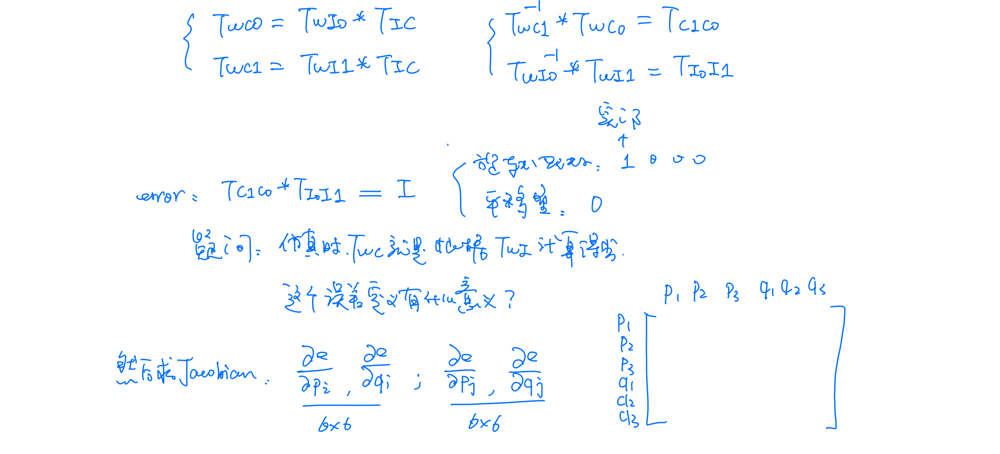
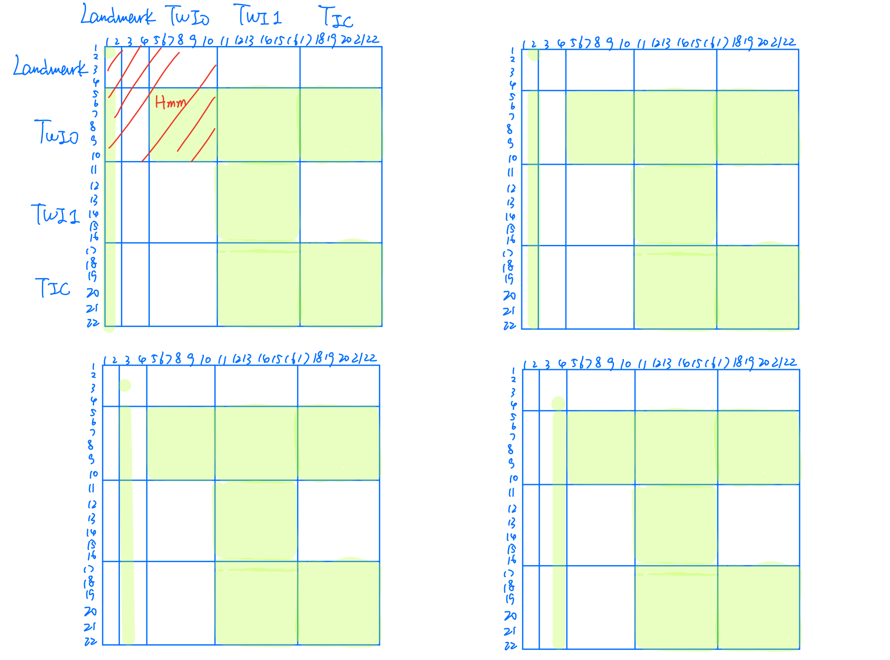
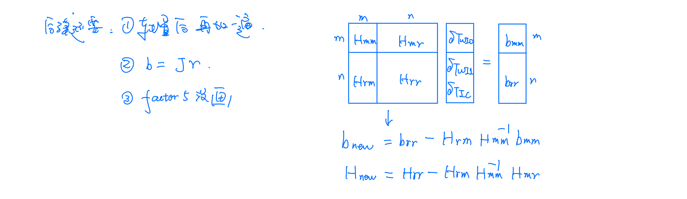

# marginalization
Sample code for marginalization of SLAM, Visual-Inertial Odometry.
The main reference is code form OKVIS and VINS_MONO. 
I will try to show how marginlaization works and  optimize the performance at the same time. 


---------------------------


##  0.引言

- 为[该库](https://github.com/pangfumin/marginalization)的学习笔记.


主要参考博客与链接：
- [VINS-MONO ProjectionFactor代码分析及公式推导](https://www.cnblogs.com/glxin/p/11990551.html),这篇文章主要推导了视觉误差对各状态量求导。
- [VINS-Mono 代码解析六、边缘化（3）](https://blog.csdn.net/hltt3838/article/details/109649675),这篇对边缘化后的先验信息处理做了详细的讲解。[系列博客都很棒](https://blog.csdn.net/hltt3838/category_10793760.html)
- [VINS-Mono关键知识点总结——边缘化marginalization理论和代码详解](https://blog.csdn.net/weixin_44580210/article/details/95748091#t11)，该博主[系列文章也很棒](https://blog.csdn.net/weixin_44580210/article/details/120805017?spm=1001.2014.3001.5502)
- [VINS-mono 代码解析——紧耦合后端非线性优化 IMU+视觉的残差residual、Jacobian、协方差、基于舒尔补的边缘化](https://blog.csdn.net/qq_43247439/article/details/107393386)
- [VINS-MONO解析——后端优化(理论部分)](https://blog.csdn.net/iwanderu/article/details/104729332)


代码解读参考链接：


- [ref1](https://github.com/Jichao-Peng/VINS-Mono-Optimization/blob/master/line_vins_estimator/src/factor/marginalization_factor.cpp)
- [ref2](https://github.com/kuankuan-yue/VINS-FUSION-leanrning/blob/master/vins_estimator/src/factor/marginalization_factor.cpp)
- [ref3](https://github.com/minxuanjun/VINS-Mono/blob/master/vins_estimator/src/factor/marginalization_factor.cpp)

##  1.pinhole_project_factor

模型：



主要还是在 视觉误差对 状态量的求导。


##  2.project_error


简单的重投影误差。


##  3.marginalization_factor

模型：




传入因子的待优化参数块,注意传入的是指针：





第二类约束没怎么看懂：







###  3.1.ResidualBlockInfo


计算每个约束的残差和Jacobian

```c

void ResidualBlockInfo::Evaluate() {
  residuals.resize(cost_function->num_residuals());

  std::vector<int> block_sizes = cost_function->parameter_block_sizes();
  raw_jacobians = new double *[block_sizes.size()]; //指针数组
  jacobians.resize(block_sizes.size());

  for (int i = 0; i < static_cast<int>(block_sizes.size()); i++) {
    // jacobians是matrix类型，resize之后会变成 残差维度×优化变量维度 大小的雅克比矩阵
    jacobians[i].resize(cost_function->num_residuals(), block_sizes[i]);
    raw_jacobians[i] = jacobians[i].data();
    std::cout<< "jacobians["<< i << "].rows: " 
             << jacobians[i].rows() << ", cols: "
             << jacobians[i].cols() << std::endl;
    // dim += block_sizes[i] == 7 ? 6 : block_sizes[i];
  }
  // 这里通过多态实现evaluate的时候计算不同的残差和雅克比矩阵
  cost_function->Evaluate(parameter_blocks.data(), residuals.data(),
                          raw_jacobians);
  ...
```


第一种约束：视觉约束

- residuals = 2  u,v重投影误差
- block_sizes = 4， param_T_WI0, param_T_WI1, param_T_IC, param_rho[i] 四个待优化变量
- std::vector < Eigen::Matrix > jacobians; // 误差对状态量的 Jacobian，Jacobian矩阵块 (2+2+2) * 7  + 2 * 1
  ```
  （a）第一个点
  jacobians[0].rows: 2, cols: 7
  jacobians[1].rows: 2, cols: 7
  jacobians[2].rows: 2, cols: 7
  jacobians[3].rows: 2, cols: 1
  
  （b）第二个点
  jacobians[0].rows: 2, cols: 7
  jacobians[1].rows: 2, cols: 7
  jacobians[2].rows: 2, cols: 7
  jacobians[3].rows: 2, cols: 1
  
  （c）第三个点
  jacobians[0].rows: 2, cols: 7
  jacobians[1].rows: 2, cols: 7
  jacobians[2].rows: 2, cols: 7
  jacobians[3].rows: 2, cols: 1
  
  （d）第四个点
  jacobians[0].rows: 2, cols: 7
  jacobians[1].rows: 2, cols: 7
  jacobians[2].rows: 2, cols: 7
  jacobians[3].rows: 2, cols: 1
  ```
- raw_jacobians则是对jacobians拼接后的Jacobian矩阵


第二种约束：位姿约束


- residuals = 6  p、q 的误差
- block_sizes = 2， param_T_WI0, param_T_WI1 两个待优化变量
- std::vector < Eigen::Matrix > jacobians; // 误差对状态量的 Jacobian，Jacobian矩阵块 (6 + 6) * 7
  ```dotnetcli
  jacobians[0].rows: 6, cols: 7
  jacobians[1].rows: 6, cols: 7
  ```
- raw_jacobians则是对jacobians拼接后的Jacobian矩阵


###  3.2.MarginalizationInfo


存储边缘化相关信息，并执行边缘化。


```c
//添加残差块相关信息（优化变量，待边缘化变量）
void MarginalizationInfo::addResidualBlockInfo(
    ResidualBlockInfo *residual_block_info) {
  factors.emplace_back(residual_block_info);

  // book size and which ones to be marginalized
  std::vector<double *> &parameter_blocks =
      residual_block_info->parameter_blocks;
  std::vector<int> parameter_block_sizes =
      residual_block_info->cost_function->parameter_block_sizes();
  // 这里应该是优化的变量
  // std::cout << "-------"<<std::endl;
  for (int i = 0;
       i < static_cast<int>(residual_block_info->parameter_blocks.size());
       i++) {
    // std::cout<<"i:" << i <<std::endl;
    double *addr = parameter_blocks[i]; //指向数据的指针
    int size = parameter_block_sizes[i];//因为仅仅有地址不行，还需要有地址指向的这个数据的长度
    parameter_block_size[reinterpret_cast<long>(addr)] = size;//将指针指向的地址作为索引，存储的是当前变量的size
  }
  // record drop_set in parameter_block_idx
  // 这里应该是待边缘化的变量
  // std::cout << "***********"<<std::endl;
  for (int i = 0; i < static_cast<int>(residual_block_info->drop_set.size());
       i++) {
    // std::cout<<"i:" << i <<std::endl;
    double *addr = parameter_blocks[residual_block_info->drop_set[i]];// std::vector<int>{0, 3}  边缘化掉 T_WI0
    parameter_block_idx[reinterpret_cast<long>(addr)] = 0;//将需要marg的变量的地址作为parameter_block_idx索引
  }
  // std::cout << "%%%%%%%%%%%"<<std::endl;
  // std::cout << "parameter_block_size: " << parameter_block_size.size() 
  //           << ", parameter_block_idx: " << parameter_block_idx.size() << std::endl;
}
```


- param_T_WI0, param_T_WI1, param_T_IC 是传入的地址，从第二次开始只有逆深度为新传入
- 对于第二类约束，没有传入新的东西
  ```
  %%%%%%%%%%%
  parameter_block_size: 4, parameter_block_idx: 2
  %%%%%%%%%%%
  parameter_block_size: 5, parameter_block_idx: 3
  %%%%%%%%%%%
  parameter_block_size: 6, parameter_block_idx: 4
  %%%%%%%%%%%
  parameter_block_size: 7, parameter_block_idx: 5
  marginalization_info->factors.size(): 4
  marginalization_info->parameter_block_size.size(): 7
  marginalization_info->parameter_block_idx.size(): 5
  %%%%%%%%%%%
  parameter_block_size: 7, parameter_block_idx: 5
  ```


###  3.3.marginalize


构建好Jacobian以及残差后对 H、b进行拼接：

```bash
----factor_it: 1----
--i: 0: idx_i: 4, size_i: 6
j: 0: idx_j: 4, size_j: 6
j: 1: idx_j: 16, size_j: 6
j: 2: idx_j: 10, size_j: 6
j: 3: idx_j: 2, size_j: 1
--i: 1: idx_i: 16, size_i: 6
j: 1: idx_j: 16, size_j: 6
j: 2: idx_j: 10, size_j: 6
j: 3: idx_j: 2, size_j: 1
--i: 2: idx_i: 10, size_i: 6
j: 2: idx_j: 10, size_j: 6
j: 3: idx_j: 2, size_j: 1
--i: 3: idx_i: 2, size_i: 1
j: 3: idx_j: 2, size_j: 1

----factor_it: 2----
--i: 0: idx_i: 4, size_i: 6
j: 0: idx_j: 4, size_j: 6
j: 1: idx_j: 16, size_j: 6
j: 2: idx_j: 10, size_j: 6
j: 3: idx_j: 1, size_j: 1
--i: 1: idx_i: 16, size_i: 6
j: 1: idx_j: 16, size_j: 6
j: 2: idx_j: 10, size_j: 6
j: 3: idx_j: 1, size_j: 1
--i: 2: idx_i: 10, size_i: 6
j: 2: idx_j: 10, size_j: 6
j: 3: idx_j: 1, size_j: 1
--i: 3: idx_i: 1, size_i: 1
j: 3: idx_j: 1, size_j: 1

----factor_it: 3----
--i: 0: idx_i: 4, size_i: 6
j: 0: idx_j: 4, size_j: 6
j: 1: idx_j: 16, size_j: 6
j: 2: idx_j: 10, size_j: 6
j: 3: idx_j: 0, size_j: 1
--i: 1: idx_i: 16, size_i: 6
j: 1: idx_j: 16, size_j: 6
j: 2: idx_j: 10, size_j: 6
j: 3: idx_j: 0, size_j: 1
--i: 2: idx_i: 10, size_i: 6
j: 2: idx_j: 10, size_j: 6
j: 3: idx_j: 0, size_j: 1
--i: 3: idx_i: 0, size_i: 1
j: 3: idx_j: 0, size_j: 1

----factor_it: 4----
--i: 0: idx_i: 4, size_i: 6
j: 0: idx_j: 4, size_j: 6
j: 1: idx_j: 16, size_j: 6
j: 2: idx_j: 10, size_j: 6
j: 3: idx_j: 3, size_j: 1
--i: 1: idx_i: 16, size_i: 6
j: 1: idx_j: 16, size_j: 6
j: 2: idx_j: 10, size_j: 6
j: 3: idx_j: 3, size_j: 1
--i: 2: idx_i: 10, size_i: 6
j: 2: idx_j: 10, size_j: 6
j: 3: idx_j: 3, size_j: 1
--i: 3: idx_i: 3, size_i: 1
j: 3: idx_j: 3, size_j: 1

----factor_it: 5----
--i: 0: idx_i: 4, size_i: 6
j: 0: idx_j: 4, size_j: 6
j: 1: idx_j: 16, size_j: 6
--i: 1: idx_i: 16, size_i: 6
j: 1: idx_j: 16, size_j: 6
```





然后对需要移除的变量进行margin：




margin后需要对剩下的 H、b恢复Jacobian存入剩余的状态变量中，留作下一轮优化。这一块参考上面列举的博客。


理论基本在上述参考博客中，如果是简单的学习，直接看 vins 的就好，如果要深入学习，那这个demo就很不错，感谢大佬开源。


